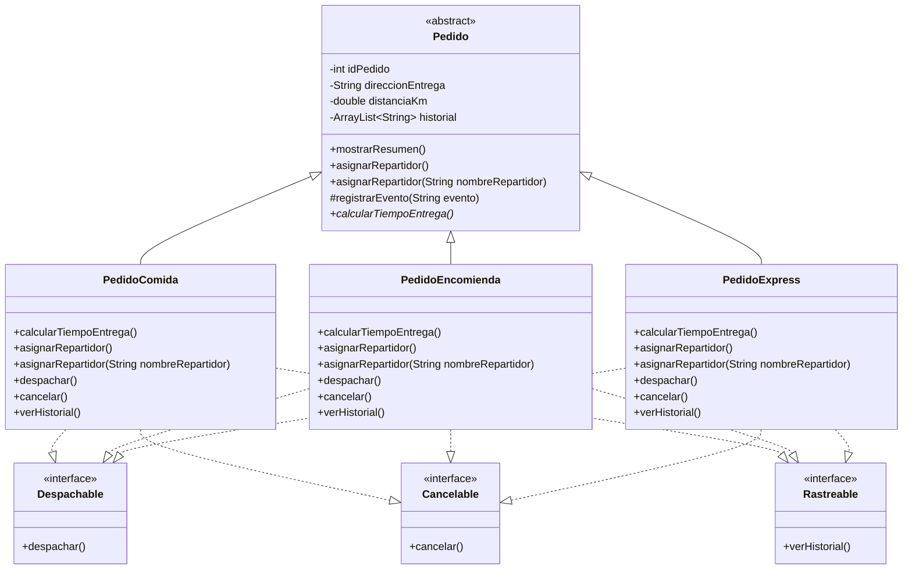

# 🧠 Evaluación – Programación Orientado a Objetos II

## 👨‍💻 Autor del proyecto

**Nombre:** Sergio Sandoval Valenzuela

**Carrera:** Analista Programador

**Sede:** Santiago Online

**Profesor:** Francesco Tossi Brante

---

# 📖 Introducción

Este repositorio contiene el desarrollo del proyecto **SpeedFast**, realizado para la asignatura **Programación Orientado a Objetos II**.

Durante la **Semana 3**, el proyecto integra los conceptos desarrollados anteriormente de herencia, polimorfismo y abstracción, incorporando además el uso de interfaces para representar diferentes capacidades de los pedidos.

El sistema permite trabajar con pedidos de comida, encomienda y express, aplicando comportamientos específicos para la asignación de repartidores, cálculo del tiempo de entrega, despacho, cancelación y consulta del historial.

---

# 🎯 Propósito del proyecto

El propósito del proyecto es aplicar conceptos de Programación Orientada a Objetos mediante una jerarquía basada en la clase abstracta `Pedido`.

El sistema permite representar diferentes tipos de pedidos, reutilizar sus características comunes y definir comportamientos específicos según el tipo de pedido.

Además, mediante las interfaces `Despachable`, `Cancelable` y `Rastreable`, se incorporan diferentes capacidades sin modificar la estructura principal de herencia.

---

# 📘 Conceptos aplicados

- Encapsulamiento.
- Herencia.
- Clases abstractas.
- Métodos abstractos.
- Métodos concretos.
- Polimorfismo.
- Sobrecarga de métodos.
- Sobrescritura mediante `@Override`.
- Interfaces.
- Implementación de múltiples interfaces.
- Desacoplamiento.
- Constructores.
- Getters y Setters.
- Uso de `super()`.
- Uso de `ArrayList`.
- Reutilización de código.
- Documentación mediante Javadoc.
- Control de versiones mediante Git.
- Publicación del proyecto en GitHub.

---

# 🧱 Estructura del proyecto

```text
SpeedFast/
│
├── .gitignore
├── README.md
└── src/
    ├── Cancelable.java
    ├── Despachable.java
    ├── Main.java
    ├── Pedido.java
    ├── PedidoComida.java
    ├── PedidoEncomienda.java
    ├── PedidoExpress.java
    └── Rastreable.java
```

---

# 🏗️ Estructura de herencia

```text
                         Pedido
                       (abstracta)
                            │
             ┌──────────────┼──────────────┐
             │              │              │
       PedidoComida   PedidoEncomienda  PedidoExpress
```

La clase abstracta `Pedido` contiene los atributos y comportamientos comunes de todos los pedidos:

- `idPedido`
- `direccionEntrega`
- `distanciaKm`
- `historial`

También implementa comportamientos comunes como `mostrarResumen()` y declara el método abstracto `calcularTiempoEntrega()`.

Las clases `PedidoComida`, `PedidoEncomienda` y `PedidoExpress` heredan de `Pedido` y especializan los comportamientos necesarios según el tipo de pedido.

---

# 📊 Diagrama de clases

El siguiente diagrama representa la relación de herencia entre los diferentes tipos de pedidos y las interfaces implementadas en el sistema.



### 📌 Leyenda del diagrama

- **`<<abstract>>`** identifica la clase abstracta `Pedido`.
- **`<<interface>>`** identifica una interfaz.
- **Línea continua con triángulo:** representa herencia mediante `extends`.
- **Línea discontinua con triángulo:** representa implementación mediante `implements`.
- **`+`** representa un elemento `public`.
- **`-`** representa un elemento `private`.
- **`#`** representa un elemento `protected`.
- **`*`** identifica el método abstracto `calcularTiempoEntrega()`.

Las clases `PedidoComida`, `PedidoEncomienda` y `PedidoExpress` heredan de `Pedido` e implementan las interfaces `Despachable`, `Cancelable` y `Rastreable`.

---

# 🧩 Abstracción

La clase `Pedido` se define como abstracta:

```java
public abstract class Pedido
```

Esto permite utilizarla como base de la jerarquía sin crear objetos `Pedido` directamente.

Además, define el método abstracto:

```java
public abstract int calcularTiempoEntrega();
```

Cada subclase implementa este método de acuerdo con sus propias reglas para calcular el tiempo estimado de entrega.

---

# ⏱️ Cálculo de tiempos de entrega

Cada tipo de pedido implementa un comportamiento diferente.

### PedidoComida

Calcula **15 minutos base más 2 minutos por kilómetro**.

```text
15 + (2 × distancia)
```

### PedidoEncomienda

Calcula **20 minutos base más 1.5 minutos por kilómetro**, ajustando el resultado a minutos enteros.

```text
20 + (1.5 × distancia)
```

### PedidoExpress

Considera **10 minutos base** y agrega **5 minutos adicionales** cuando la distancia supera los 5 kilómetros.

```text
10 minutos
+ 5 minutos si distancia > 5 km
```

---

# 🔄 Sobrecarga y sobrescritura

El sistema utiliza sobrecarga mediante dos versiones del método `asignarRepartidor()`:

```java
asignarRepartidor()
```

y:

```java
asignarRepartidor(String nombreRepartidor)
```

La primera versión permite representar una asignación automática, mientras que la segunda permite indicar manualmente el nombre del repartidor.

Las subclases sobrescriben estos comportamientos mediante `@Override` para aplicar reglas específicas según el tipo de pedido.

Por ejemplo:

- `PedidoComida` verifica una mochila térmica.
- `PedidoEncomienda` verifica peso y embalaje.
- `PedidoExpress` busca disponibilidad inmediata.

---

# 🔄 Polimorfismo

En `Main`, los objetos se declaran utilizando referencias de tipo `Pedido`:

```java
Pedido pedido1 = new PedidoComida(...);
Pedido pedido2 = new PedidoEncomienda(...);
Pedido pedido3 = new PedidoExpress(...);
```

Aunque las referencias son de tipo `Pedido`, cada objeto ejecuta el comportamiento correspondiente a su clase real.

Esto permite utilizar una estructura común y mantener comportamientos diferentes para cada tipo de pedido.

---

# 🔌 Interfaces

Durante la Semana 3 se incorporan tres interfaces.

### Despachable

Define la capacidad de despachar un pedido:

```java
void despachar();
```

### Cancelable

Define la capacidad de cancelar un pedido:

```java
void cancelar();
```

### Rastreable

Define la capacidad de consultar el historial de un pedido:

```java
void verHistorial();
```

Las clases `PedidoComida`, `PedidoEncomienda` y `PedidoExpress` implementan estas interfaces y proporcionan su propio comportamiento.

De esta manera, la jerarquía representa qué tipo de objeto es cada pedido, mientras que las interfaces representan las capacidades que puede realizar.

---

# 📋 Historial de pedidos

Cada pedido mantiene un historial mediante un `ArrayList<String>`.

Cuando se realizan acciones sobre un pedido, estas se registran en su historial.

Entre los eventos registrados se encuentran:

- Creación del pedido.
- Asignación de repartidor.
- Despacho del pedido.
- Cancelación del pedido.

Posteriormente, mediante el método:

```java
verHistorial()
```

es posible visualizar los eventos que realmente fueron realizados sobre cada pedido.

---

# 💻 Tecnologías utilizadas

- Java JDK 26.
- IntelliJ IDEA.
- Git.
- GitHub.
- Markdown.
- Mermaid.

---

# 🚀 Ejecución

1. Abrir el proyecto `SpeedFast` en IntelliJ IDEA.
2. Ejecutar la clase `Main.java`.
3. El sistema mostrará los tres tipos de pedidos.
4. Se calculará el tiempo estimado de entrega.
5. Se realizará la asignación automática o manual de repartidores.
6. Se ejecutarán operaciones de despacho o cancelación.
7. Finalmente, se mostrará el historial de cada pedido.

---

# 🖥️ Ejemplo de salida

```text
========================================
          SISTEMA SPEEDFAST
========================================

PEDIDO 1
----------------------------------------
PedidoComida #1
Direccion: Av. Italia 456
Distancia: 4.5 km
Tiempo estimado de entrega: 24 minutos
[Pedido Comida]
Asignando repartidor...
Verificando mochila termica... OK
Repartidor asignado automaticamente: Carlos Soto
Pedido de comida despachado correctamente.

PEDIDO 2
----------------------------------------
PedidoEncomienda #2
Direccion: Av. Independencia 123
Distancia: 6.0 km
Tiempo estimado de entrega: 29 minutos
[Pedido Encomienda]
Asignando repartidor...
Verificando peso y embalaje... OK
Pedido asignado a Daniela Tapia
Pedido de encomienda despachado correctamente.

PEDIDO 3
----------------------------------------
PedidoExpress #3
Direccion: Av. Apoquindo 1500
Distancia: 7.0 km
Tiempo estimado de entrega: 15 minutos
[Pedido Express]
Asignando repartidor...
Buscando repartidor mas cercano con disponibilidad inmediata... OK
Pedido asignado a Luis Diaz
Pedido express cancelado correctamente.

========================================
              HISTORIALES
========================================

Historial del PedidoComida #1:
- Pedido creado.
- Repartidor asignado automaticamente: Carlos Soto
- Pedido de comida despachado.

Historial del PedidoEncomienda #2:
- Pedido creado.
- Repartidor asignado: Daniela Tapia
- Pedido de encomienda despachado.

Historial del PedidoExpress #3:
- Pedido creado.
- Repartidor asignado: Luis Diaz
- Pedido express cancelado.

========================================
```

---

# 📄 Funcionalidades implementadas

- Clase abstracta `Pedido`.
- Creación de pedidos de comida, encomienda y express.
- Encapsulamiento de atributos comunes.
- Herencia desde la clase `Pedido`.
- Método concreto `mostrarResumen()`.
- Método abstracto `calcularTiempoEntrega()`.
- Cálculo de tiempos según el tipo de pedido.
- Sobrecarga de `asignarRepartidor()`.
- Sobrescritura mediante `@Override`.
- Asignación automática de repartidor.
- Asignación manual de repartidor.
- Polimorfismo mediante referencias de tipo `Pedido`.
- Interfaz `Despachable`.
- Interfaz `Cancelable`.
- Interfaz `Rastreable`.
- Implementación de múltiples interfaces.
- Despacho de pedidos.
- Cancelación de pedidos.
- Registro de eventos mediante `ArrayList`.
- Visualización del historial.
- Reutilización de código.
- Salida ordenada por consola.
- Documentación mediante Javadoc.
- Control de versiones mediante Git y GitHub.

---

# 📈 Reutilización y mantenibilidad

La clase abstracta `Pedido` centraliza los atributos y comportamientos comunes, evitando repetir código en las subclases.

Cada subclase contiene las reglas específicas correspondientes a su tipo de pedido.

Las interfaces permiten separar capacidades como despacho, cancelación y rastreo de la jerarquía principal, facilitando la incorporación de nuevos tipos de pedidos o comportamientos en el futuro.

Esta estructura permite mantener el proyecto organizado, reutilizable y más fácil de modificar.

---

# ✅ Conclusión

El proyecto **SpeedFast** integra los principales conceptos trabajados durante las primeras tres semanas de Programación Orientado a Objetos II.

La clase abstracta `Pedido` permite centralizar información y comportamientos comunes, mientras que `PedidoComida`, `PedidoEncomienda` y `PedidoExpress` especializan sus reglas mediante herencia, sobrecarga, sobrescritura y polimorfismo.

La incorporación de las interfaces `Despachable`, `Cancelable` y `Rastreable` permite separar diferentes capacidades de los pedidos y mejorar la organización del sistema.

Finalmente, el historial permite registrar las acciones realizadas sobre cada pedido, demostrando el funcionamiento integrado del sistema mediante la ejecución de diferentes casos en `Main`.

---

# 🔗 Repositorio

**GitHub**

https://github.com/sergiosandovalv/SpeedFast
